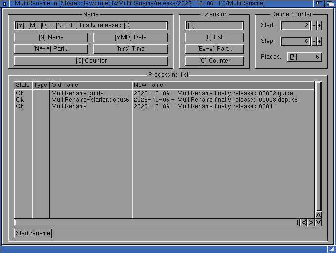

# MultiRename

Another tool for Amiga computers. This time it's a MultiRename tool in the vein
of that one, Windows tool [TotalCommander](https://www.ghisler.com) has built
in. I use this a lot and wanted something like this on my favorite retro
Computer.

To run it, AmigaOS 3.2.3 (!) is needed: MultiRename uses *BOOPSI objects
(Reaction)* and needs a recently updated function of `string.gadget` which was
released in the 3.2.3 update in April 2025.



# Build and debug

## Amiga

On the Amiga you need *OS3.2.2* with a fully installed *SAS-C 6.5* and
[Codecraft](http://boemann.dk/codecraft/) development environment.

Open Codecraft, open the project file `MultiRename.projecttree`, use the
Build menu to build, then hit `F5` to run the app in the debugger.

## Linux

### Dependencies

The project was built with Debian on Windows with the Linux subsystem
(WSL). The following packages must be installed in Debian:

 - build-essentials
 - cmake
 - git
 - ([Bebbos gcc 6.5 toolchain @ Github, retired](https://github.com/bebbo/amiga-gcc))
 - [Bebbos gcc 6.5 toolchain @ Codeberg](https://codeberg.org/bebbo/amiga-gcc)
which is expected to be installed in /opt

**NOTE:** for the Codeberg variant, you'll have to replace

```bash
git clone https://github.com/bebbo/amiga-gcc
```

with

```bash
git clone https://franke.ms/git/bebbo/amiga-gcc.git
```

(as shown in an [Amiga forum](https://www.a1k.org/forum/index.php?threads/94725/post-1882035).)

For more about Bebbos gcc, read [this blog](https://mbergmann-sh.de/2025/10/04/bebbos-amiga-gcc-cross-compiler-toolchain-ist-umgezogen/).

### Build
To build this project a Makefile must be created with cmake:

- Manually create a directory *build-gcc* next to the *src* directory

- Enter this directory and type.

```bash
cmake -DCMAKE_BUILD_TYPE=Release ..
```

- For preparing a debug Makefile with debug information, type:

```bash
cmake -DCMAKE_BUILD_TYPE=Debug ..
```

Then cmake is configured. Build can be started by simply typing 
    
```bash
make
```

from inside the build directory.

After the build was successful the binary *Pooyan_gcc* is copied into
the project root directory.

## VSCode integration
The VSCode default build task (see tasks.json) has been updated to use
the *cmake* generated Makefile inside the *build* directory.

So, after cmake is prepared for debug or release (see above), building
can be started with *Ctrl + Shift + b* from within VSCode.

### Debug the RenameParser test with Linux

To debug the RenameParser test in the `scr/_tests` directory with Linux,
the cmake run, see above, must've been done with the
`-DCMAKE_BUILD_TYPE=Debug` option. Only then the breakpoints you set in
VSCode will be hit.

With this done properly the `test_action_parser.c` entry point can be
build and run in debug mode by simply hitting `F5` in VScode.
