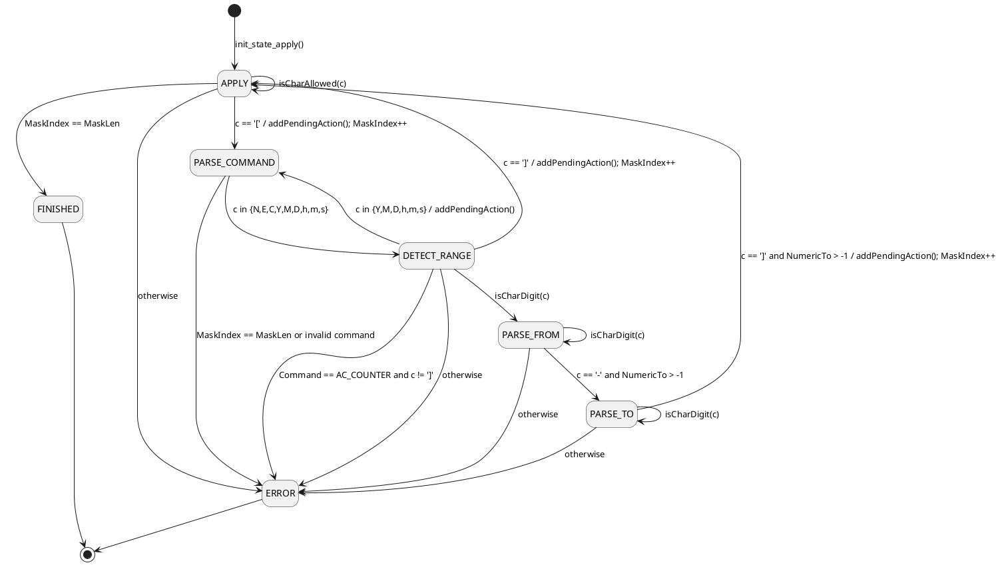

# Action Parser State Machine

The following PlantUML diagram documents the state machine implemented in the action parser in src/rename_parser.c.

```plantuml
@startuml
hide empty description

[*] --> APPLY : init_state_apply()

APPLY --> FINISHED : MaskIndex == MaskLen
APPLY --> APPLY : isCharAllowed(c)
APPLY --> PARSE_COMMAND : c == '[' / addPendingAction(); MaskIndex++
APPLY --> ERROR : otherwise

PARSE_COMMAND --> DETECT_RANGE : c in {N,E,C,Y,M,D,h,m,s}
PARSE_COMMAND --> ERROR : MaskIndex == MaskLen or invalid command

DETECT_RANGE --> PARSE_COMMAND : c in {Y,M,D,h,m,s} / addPendingAction()
DETECT_RANGE --> APPLY : c == ']' / addPendingAction(); MaskIndex++
DETECT_RANGE --> ERROR : Command == AC_COUNTER and c != ']'
DETECT_RANGE --> PARSE_FROM : isCharDigit(c)
DETECT_RANGE --> ERROR : otherwise

PARSE_FROM --> PARSE_FROM : isCharDigit(c)
PARSE_FROM --> PARSE_TO : c == '-' and NumericTo > -1
PARSE_FROM --> ERROR : otherwise

PARSE_TO --> PARSE_TO : isCharDigit(c)
PARSE_TO --> APPLY : c == ']' and NumericTo > -1 / addPendingAction(); MaskIndex++
PARSE_TO --> ERROR : otherwise

FINISHED --> [*]
ERROR --> [*]
@enduml
```
